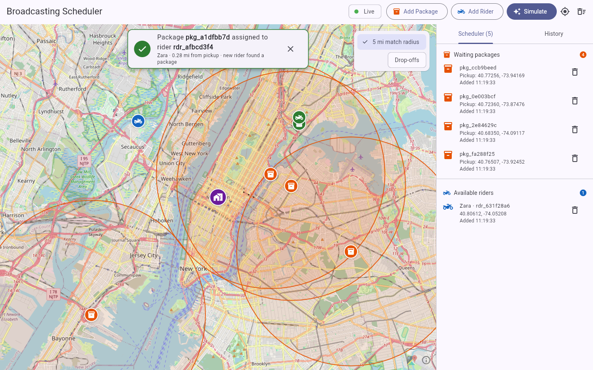
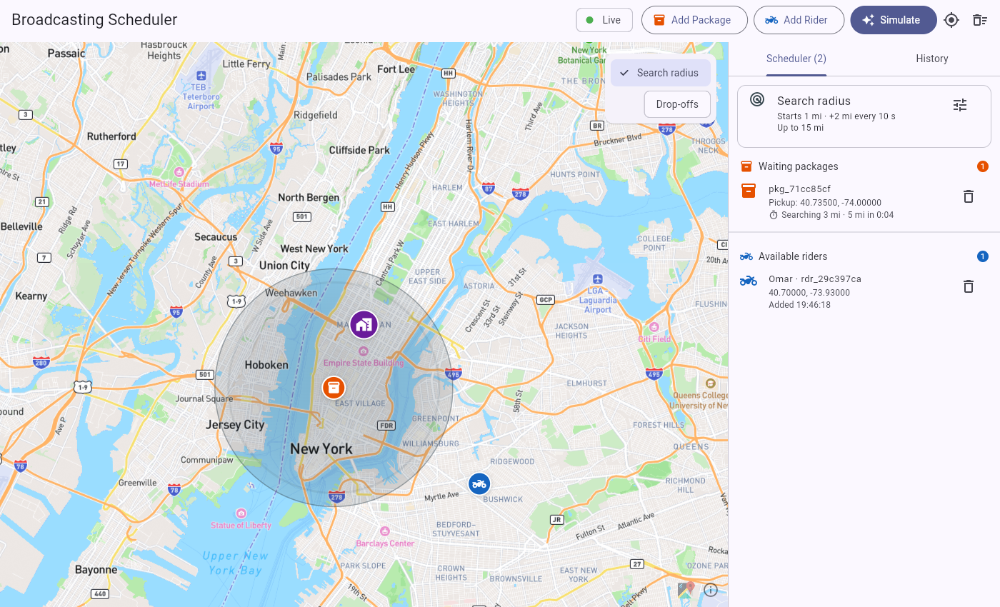
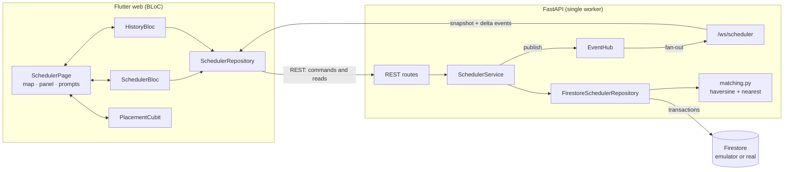

# Intelligent Broadcasting Scheduler

A live dispatch map. Packages and riders enter a **scheduler**. Each new arrival is **paired
straight away with the nearest counterpart** within the package's search radius. A package
that finds nobody **widens its search over time**: it starts at 1 mile and grows by 2 miles
every 30 seconds, up to 15 miles, all adjustable from the UI. The pair leaves the scheduler,
the assignment is saved, and every connected browser sees the change at once over a
WebSocket.

- **Backend:** Python 3.12, FastAPI, Google Cloud Firestore (emulator by default), managed with `uv`
- **Frontend:** Flutter web, BLoC (`flutter_bloc`), `flutter_map` with Mapbox Streets tiles (OpenStreetMap without a token)
- **Realtime:** FastAPI WebSockets (`/ws/scheduler`): a full snapshot on connect, then delta events





---

## What it does

| | |
|---|---|
| **Map centred on the admin** | The admin location comes from `GET /admin` (a Firestore document, seeded from settings on first start). |
| **Add packages and riders** | Click the map (packages take two clicks: pickup, then drop-off), type coordinates, or **Simulate** random traffic around the admin. |
| **Instant nearest pairing** | New package → nearest *available* rider to its pickup. New rider → nearest *waiting* package whose search radius reaches it. Distance is haversine (great-circle). If nothing is in range, the item waits. |
| **Growing search radius** | Each waiting package has its own timer: its radius starts at 1 mi and grows by 2 mi every 30 s, up to 15 mi. Every growth re-runs matching, oldest package first. The start, increment, timer and cap are editable from the **Search radius** card (or `PUT /settings/radius`) and apply to every waiting package at once. |
| **Live radar** | Each waiting package pulses inside a radar disk the size of its current radius. The disk widens smoothly when it grows, and the side panel counts down to the next growth. |
| **Assignment prompt** | "Package `pkg_…` assigned to rider `rdr_…`". The prompt also shows the rider name, distance and trigger. The pair pulses on the map and is joined by a green line. |
| **History panel** | Every assignment, newest first. It loads over REST and updates live. |
| **Safe under concurrency** | Pairing runs inside a Firestore transaction, so a rider or package is never double-assigned. Tested with concurrent requests against the emulator. |
| **Self-healing live feed** | The WebSocket reconnects with exponential backoff. Each reconnect gets a fresh snapshot, so the UI can't silently drift out of sync. |

## Architecture at a glance



More detail is in [docs/architecture.md](docs/architecture.md).

## Quick start

### Option A: run locally (recommended for development)

Prerequisites: Python 3.12 + [uv](https://docs.astral.sh/uv/), Flutter ≥ 3.41, Firebase CLI, Java 21+ (needed by the emulator).

```sh
# 1. Firestore emulator (terminal 1). Emulator UI at http://localhost:4000
firebase emulators:start --only firestore --project demo-broadcast-scheduler

# 2. API (terminal 2). Swagger UI at http://localhost:8000/docs
cd backend
uv sync
uv run fastapi dev src/broadcast_scheduler/main.py

# 3. Web app (terminal 3)
cd frontend
flutter pub get
flutter run -d chrome --dart-define-from-file=../.env
```

**Map tiles.** Copy `.env.example` to `.env` in the repo root and set `MAPBOX_TOKEN` to a
public Mapbox token (`pk.…`) for Mapbox Streets. Leave it empty, or drop
`--dart-define-from-file`, to use OpenStreetMap tiles. The app talks to
`http://localhost:8000` unless you pass `--dart-define=API_BASE_URL=…`.

No emulator? Start the API with `STORAGE_BACKEND=memory uv run fastapi dev src/broadcast_scheduler/main.py`.
This uses an in-process store whose data is lost on restart.

### Option B: Docker Compose

```sh
docker compose up --build        # reads MAPBOX_TOKEN from the root .env, if present
# Web  http://localhost:8081   API  http://localhost:8000/docs
```

### Try it

1. Click **Simulate** → 10 packages, 6 riders, 9-mile spawn radius → **Run**. Some pair
   straight away (prompts appear). The rest wait inside a breathing radar disk showing their
   current search radius, which widens every 30 s until it reaches a rider.
2. **Add Rider → Pick on map** and click inside a waiting package's circle. The two pair,
   and a prompt names both ids.
3. Click the tune button on the **Search radius** card, set the timer to 5 s and **Apply**.
   Watch the disks grow and the countdowns in the side panel tick.
4. Open **History** to see every assignment, including ones where the search radius grew
   to reach a rider.
5. Open a second browser tab: both update together.

## Repository layout

```
.
├── backend/                  FastAPI service (uv project)
│   ├── src/broadcast_scheduler/
│   │   ├── main.py           app factory, lifespan, error mapping
│   │   ├── api.py            REST + WebSocket routes
│   │   ├── service.py        SchedulerService: persist, publish events, radius timer
│   │   ├── matching.py       who pairs with whom (pure)
│   │   ├── geo.py            haversine, nearest, random points (pure)
│   │   ├── realtime.py       EventHub: per-client bounded queues
│   │   ├── models.py         every schema (API, Firestore, events)
│   │   ├── config.py         settings from env / .env
│   │   └── repositories/     base protocol, Firestore, in-memory
│   └── tests/                103 tests; the contract suite also runs on the emulator
├── frontend/                 Flutter web app
│   ├── lib/
│   │   ├── bloc/             SchedulerBloc, HistoryBloc, PlacementCubit
│   │   ├── data/             models, REST client, WebSocket client, repository
│   │   └── ui/               page, map, side panel, prompts, dialogs
│   └── test/                 57 tests (blocs, socket, API client, models, widgets)
├── docs/                     full documentation (start at docs/README.md)
├── docker-compose.yml
├── firebase.json             emulator config (Firestore :8080, UI :4000)
└── .github/workflows/ci.yml  lint + tests for both apps
```

## Documentation

| Doc | What's in it |
|---|---|
| [docs/architecture.md](docs/architecture.md) | Components, request flows, sequence diagrams, consistency guarantees |
| [docs/matching-algorithm.md](docs/matching-algorithm.md) | Pairing rules, the growing search radius, haversine, tie-breaking, transactions |
| [docs/api-reference.md](docs/api-reference.md) | Every REST endpoint with real request/response examples |
| [docs/websocket-events.md](docs/websocket-events.md) | The `/ws/scheduler` protocol and event catalogue |
| [docs/data-model.md](docs/data-model.md) | Firestore collections, document shapes, status lifecycle |
| [docs/frontend.md](docs/frontend.md) | BLoC design, UI components, the map-placement flow |
| [docs/setup.md](docs/setup.md) | Configuration reference, real Firebase project, Docker, troubleshooting |
| [docs/testing.md](docs/testing.md) | What is tested and how to run it |
| [docs/adr/](docs/adr/) | Architecture decision records |
| [docs/roadmap.md](docs/roadmap.md) | Ideas for what to build next |

## Tests

```sh
cd backend && uv run pytest                        # 85 pass, 18 Firestore tests skip
firebase emulators:exec --only firestore --project demo-broadcast-scheduler \
  "cd backend && uv run pytest"                     # all 103, including the emulator
cd frontend && flutter test                         # 57
```
