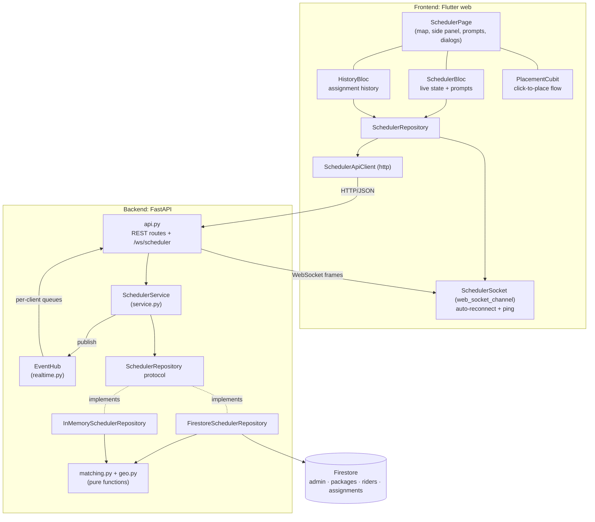
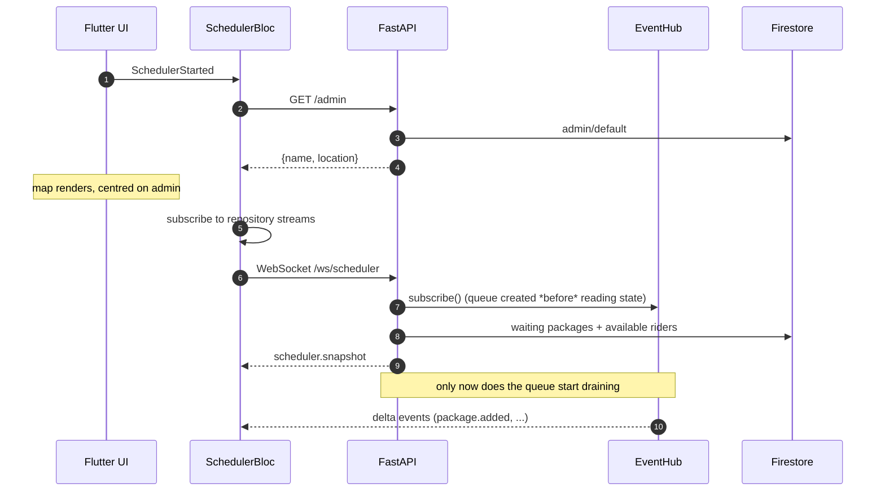
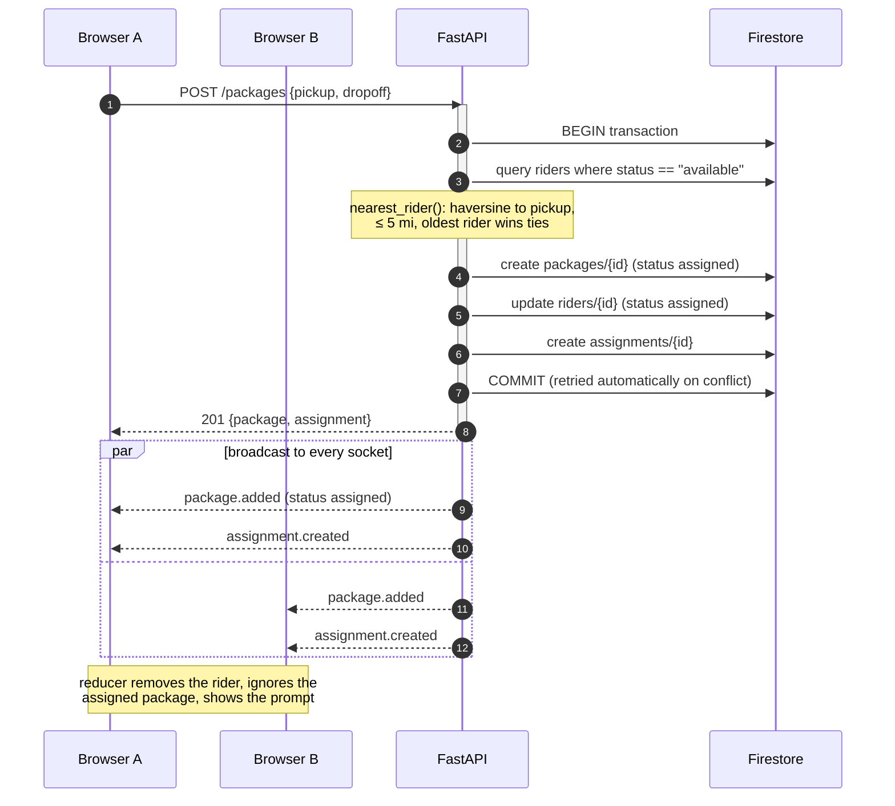
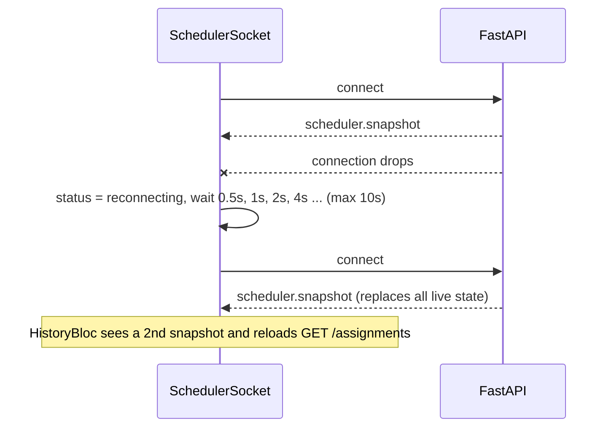

# Architecture

## 1. Big picture

### Backend layers

| Layer | Module | Responsibility | Knows about |
|---|---|---|---|
| Transport | `api.py`, `main.py` | Validation (Pydantic), HTTP status codes, WebSocket session | Service |
| Application | `service.py` | Runs each operation: persist, then publish events. Seeds the admin. Simulation. | Repository protocol, EventHub |
| Domain | `matching.py`, `geo.py`, `models.py` | Who pairs with whom, distance maths, all shapes | Nothing: pure functions |
| Persistence | `repositories/` | Atomic "store + match" per backend | Domain |
| Realtime | `realtime.py` | Fan-out of events to sockets with per-client bounded queues | Models |

Two rules keep this simple:

1. **Every write goes through `SchedulerService`**, and the service publishes an event after
   each successful write. That's why clients never miss a change made through the API.
2. **Matching decisions are pure** (`matching.py`). Repositories decide *how* to make them
   atomic, but never *what* to match. Both storage backends share the same rules, and one
   contract test suite checks both (see [testing.md](testing.md)).

### Frontend layers

| Layer | Location | Responsibility |
|---|---|---|
| UI | `lib/ui/` | Widgets only. Reads bloc state, dispatches bloc events. |
| State | `lib/bloc/` | `SchedulerBloc` (live view), `HistoryBloc` (history), `PlacementCubit` (map clicks) |
| Data | `lib/data/` | Typed models, REST client, WebSocket client, `SchedulerRepository` façade |
| Core | `lib/core/` | Config from `--dart-define`, `ApiException` |

## 2. Key flows

### 2.1 Page load and live connection

Registering the queue *before* reading the snapshot, and draining it only *after* sending
the snapshot, means **no event can fall into the gap** between "state read" and "client
subscribed". Events already included in the snapshot may arrive again. That's harmless,
because the client reducer is idempotent (see [websocket-events.md](websocket-events.md#ordering-and-idempotency)).

### 2.2 Adding a package that gets paired

If no rider is within range, the transaction only creates the package with `status: waiting`,
and the browsers get just `package.added`. The package appears on the map with its 5-mile
circle.

Adding a rider is the mirror image: the transaction queries `packages where status ==
"waiting"` and pairs with the nearest pickup.

### 2.3 Reconnect

## 3. Consistency guarantees

| Guarantee | How |
|---|---|
| A rider or package is never paired twice | Candidate query and writes run in one Firestore transaction. A concurrent commit that changes a read document aborts and retries ours. Verified by `test_rider_is_never_double_assigned_under_concurrency` against the emulator. |
| Removing an assigned item is rejected | `DELETE` runs a transactional read-check-delete and returns **409**. |
| Clients converge | WebSocket snapshot on every (re)connect, plus an idempotent reducer. A client that is too slow (1000 queued events) is disconnected and resyncs on reconnect. |
| No lost events around subscribe | Subscribe → snapshot → drain order in `scheduler_socket` (§2.1). |

### Known limits

- **Single API process.** `EventHub` is in memory, so events only reach sockets connected to
  the process that handled the write. Run one worker (Dockerfile and `run()` do). The path to
  scaling out is in [ADR 0002](adr/0002-realtime-websockets.md#scaling-beyond-one-process).
- **Writes that bypass the API** (e.g. editing Firestore in the emulator UI) don't produce
  events until clients reconnect. Doing this on purpose is also covered by ADR 0002.
- **Matching reads every waiting candidate.** That's fine for hundreds of items. For
  thousands, see [matching-algorithm.md §6](matching-algorithm.md#6-scaling-the-candidate-search).

## 4. Relationship to the original `scheduler_engine`

This project takes one use case from the production engine and rebuilds it cleanly for
visualisation:

| Production engine | This project |
|---|---|
| Redis GEO (`georadius`) for proximity | Haversine over Firestore query results ([ADR 0001](adr/0001-firestore-only-storage.md)) |
| Broadcast to many riders, accept/reject, radius widens on retries (Cloud Tasks) | Instant nearest pairing ([ADR 0003](adr/0003-instant-nearest-pairing.md)) |
| Pub/Sub events between services | In-process `EventHub` → WebSocket |
| Redis `WATCH`/`MULTI` optimistic locking | Firestore transactions |

The design keeps room for the broadcast model. See [roadmap.md](roadmap.md).
