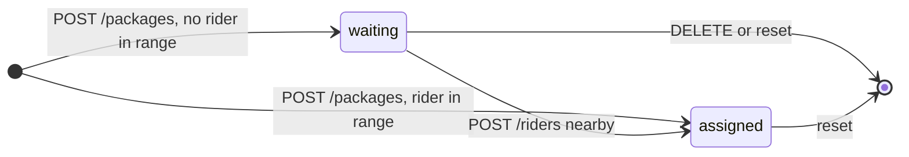
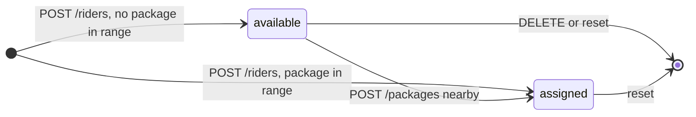

# Data model (Firestore)

The backend is the only thing that reads or writes Firestore. It uses the server SDK, which
bypasses security rules. `firestore.rules` denies all client access, so a leaked project config
can't be used to read or write the data directly.

## Collections

Every collection name can be prefixed with `COLLECTION_PREFIX` (the tests use a random
prefix per test for isolation).

| Path | Document | Written by |
|---|---|---|
| `admin/default` | `Admin` | startup seed, `PUT /admin` |
| `packages/{package_id}` | `Package` | `POST /packages`, pairing, `DELETE`, reset |
| `riders/{rider_id}` | `Rider` | `POST /riders`, pairing, `DELETE`, reset |
| `assignments/{assignment_id}` | `Assignment` | pairing, reset |

Document ids equal the entity `id` field (`pkg_3f9a1c2b`, …).

### Example documents

```jsonc
// packages/pkg_ff2b6b8f
{
  "id": "pkg_ff2b6b8f",
  "pickup":  { "lat": 40.758,  "lng": -73.9855, "address": "1560 Broadway" },
  "dropoff": { "lat": 40.7484, "lng": -73.9857, "address": "350 5th Ave" },
  "status": "assigned",                 // "waiting" | "assigned"
  "created_at": Timestamp,              // native Firestore timestamp
  "assigned_rider_id": "rdr_c14661b1",  // null while waiting
  "assigned_at": Timestamp              // null while waiting
}

// riders/rdr_c14661b1
{
  "id": "rdr_c14661b1",
  "name": "Ali",
  "location": { "lat": 40.7644, "lng": -73.9735 },
  "status": "assigned",                 // "available" | "assigned"
  "created_at": Timestamp,
  "assigned_package_id": "pkg_ff2b6b8f",
  "assigned_at": Timestamp
}

// assignments/asg_f09805ff  (denormalised: the history needs no lookups)
{
  "id": "asg_f09805ff",
  "package_id": "pkg_ff2b6b8f",
  "rider_id": "rdr_c14661b1",
  "rider_name": "Ali",
  "distance_miles": 0.768,
  "pickup": {...}, "dropoff": {...},
  "rider_location": { "lat": 40.7644, "lng": -73.9735 },
  "trigger": "package_added",           // "package_added" | "rider_added" | "radius_expanded"
  "created_at": Timestamp
}
```

Serialisation (`_to_doc` in `repositories/firestore.py`): Pydantic `model_dump(mode="python")`
keeps `datetime`s as native Timestamps (so `order_by("created_at")` works) and converts enums
to their string values. Reading back uses `Model.model_validate(snapshot.to_dict())`.

## Status lifecycle



*Package statuses.* Riders follow the same shape with `available` in place of `waiting`:



"In the scheduler" means `package.status == waiting` or `rider.status == available`. Paired
items are **kept**, marked `assigned`, rather than deleted, so each pairing stays traceable
from both sides.

## Queries and indexes

| Query | Index needed |
|---|---|
| `riders where status == "available"` (inside a transaction) | automatic single-field |
| `packages where status == "waiting"` (inside a transaction) | automatic single-field |
| `assignments order_by created_at desc limit N` | automatic single-field |

Filtered lists are sorted by `created_at` **in Python**, so no composite indexes are ever
required, even on a real project.
