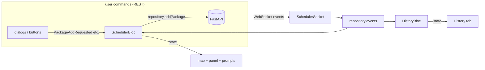
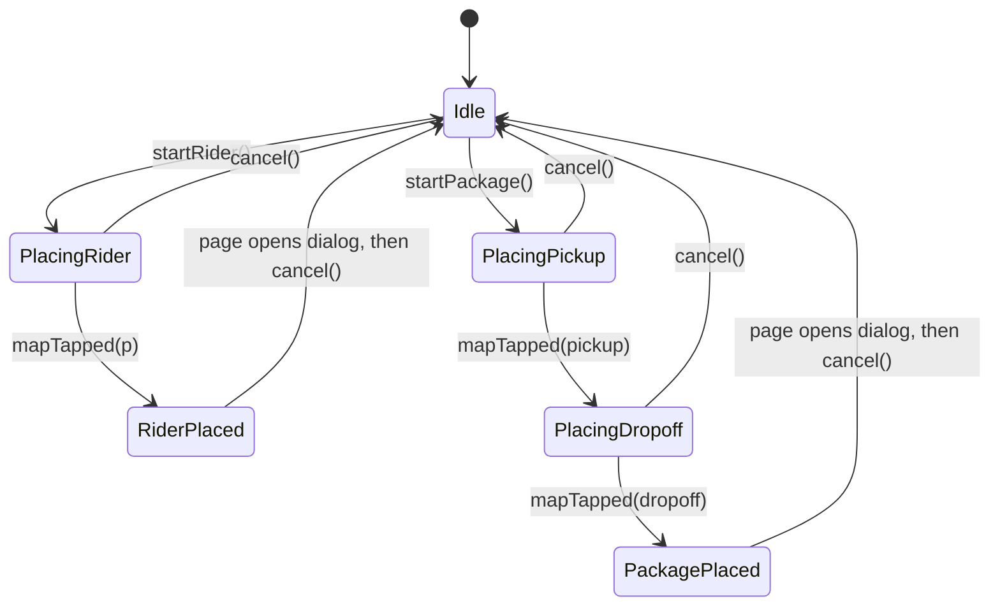

# Frontend (Flutter web + BLoC)

```
frontend/lib/
├── main.dart                  builds config → API client + socket → repository → app
├── app.dart                   RepositoryProvider + MultiBlocProvider + MaterialApp
├── core/
│   ├── app_config.dart        API_BASE_URL (--dart-define), derives ws:// URL
│   └── api_exception.dart
├── data/
│   ├── models/                Coordinates, Place, Admin, Package, Rider, Assignment,
│   │                          SchedulerSnapshot, drafts, sealed ServerEvent hierarchy
│   ├── api/scheduler_api_client.dart     REST (package:http)
│   ├── realtime/scheduler_socket.dart    WebSocket with backoff + ping
│   └── repositories/scheduler_repository.dart   single façade for blocs
├── bloc/
│   ├── scheduler/             SchedulerBloc (+ events, state, reducer)
│   ├── history/               HistoryBloc
│   └── placement/             PlacementCubit
└── ui/
    ├── pages/scheduler_page.dart
    ├── widgets/               scheduler_map, radar_layer, map_lines_layer, map_markers,
    │                          side_panel, assignment_prompts, connection_badge
    ├── dialogs/               add package / rider, simulate, confirm reset
    ├── geo_shapes.dart        unit constants
    ├── formatting.dart, theme.dart
```

## Data flow



**The rule ([ADR 0004](adr/0004-websocket-as-ui-source-of-truth.md)):** the result of a
command is never applied to UI state directly. The UI changes only when the matching
WebSocket event arrives. Every browser tab takes the same path, so they all end up showing
the same thing.

## `SchedulerBloc`

| | |
|---|---|
| **State** | `loadStatus`, `admin`, `packages` (waiting, by id), `riders` (available, by id), `radiusPolicy`, `connection`, `hasSnapshot`, `recentAssignments` (prompts), `pendingRequests`, `errorMessage` |
| **Start** | `SchedulerStarted` → `GET /admin` (REST) → subscribe to `connectionChanges` and `events` with `emit.forEach` → `repository.connect()` |
| **Reducer** | `reduceServerEvent(state, event)` is a pure, exhaustive `switch` over the sealed `ServerEvent`, and idempotent |
| **Commands** | `PackageAddRequested`, `RiderAddRequested`, `PackageRemoveRequested`, `RiderRemoveRequested`, `SimulationRequested`, `SchedulerResetRequested`: each increments `pendingRequests`, awaits the REST call, and turns an `ApiException` into `errorMessage` |
| **Prompts** | On `assignment.created` the assignment is prepended to `recentAssignments`, and a timer (default 6 s, `promptDuration`) fires a private `_AssignmentPromptExpired`. `AssignmentPromptDismissed` removes a prompt early. Timers are cancelled in `close()`. |
| **Errors** | The page's `BlocListener` shows a SnackBar, then dispatches `SchedulerErrorDismissed` |

The prompts are state rather than one-off UI side effects. Because of that, the prompt stack
and the map highlight (green line + pulsing pins) both render from `recentAssignments`, and
the timing can be tested with `bloc_test`.

## `HistoryBloc`

- `HistoryStarted` subscribes to `events` **before** calling `GET /assignments`, so nothing
  that happens during the load is lost. Live `assignment.created` events are prepended, with
  de-duplication by id and a cap of `limit` (100).
- `scheduler.reset` clears the list.
- A **second** `scheduler.snapshot` means the socket reconnected, and assignments may have
  been missed while offline, so it dispatches `HistoryRefreshed` to reload from REST.

## `PlacementCubit`

A small state machine behind "Pick on map":



While placing, the map shows a crosshair cursor and a banner with instructions and a
**Cancel** button. The chosen pickup shows as an outlined pin until the drop-off is clicked.
The terminal states open the add dialog **pre-filled** with the clicked coordinates, so they
can still be adjusted before submitting.

## `SchedulerSocket`

- `connect()` → `connecting` → `connected`. When a connection fails or drops →
  `reconnecting`, then retries after 0.5 s, 1 s, 2 s, 4 s, 8 s, 10 s, 10 s …
- Sends `ping` every 25 s and ignores `pong`.
- Malformed frames are skipped and never close the connection. Unknown event types
  become `UnknownEvent`.
- Transport sits behind the small `SocketConnection` interface, so tests use a fake with
  `fake_async` to check the exact backoff timings.

## UI

| Widget | Notes |
|---|---|
| `SchedulerPage` | App bar (connection badge, Add Package / Add Rider menus, Simulate, centre, reset). Map on the left, 380 px side panel on the right. Below 960 px the panel moves into an end drawer and the actions collapse to icons plus a "more" menu. |
| `SchedulerMap` | OSM tiles, breathing radar disks (5-mile match range) around waiting pickups (toggle), dashed pickup→drop-off lines and drop-off flags (toggle), green rider→pickup lines for fresh assignments, markers with hover tooltips. Re-centres on `admin.updated`. |
| `AssignmentPrompts` | Stack of cards: "Package **pkg_…** assigned to rider **rdr_…**", plus rider name, distance and trigger. At most 4 visible, then a "+N more" chip; the stack scrolls instead of overflowing. |
| `SidePanel` | Tab 1 lists waiting packages and available riders (tap to pan the map, bin icon to remove). Tab 2 is the history. |
| Dialogs | Validated lat/lng fields (±90/±180), optional addresses, a name for riders; simulate sliders. |

Colours are consistent everywhere (`ui/theme.dart`): admin purple, package orange,
rider blue, assignment green, drop-off grey.

### Search radius controls

The Scheduler tab starts with a **Search radius** card summarising the policy (start,
increment, timer, cap). Its tune button opens `RadiusSettingsDialog`: four sliders plus a
live sentence describing how a package's search grows, and a **Defaults** button. **Apply**
sends `PUT /settings/radius`; the new policy comes back through `radius_policy.updated` like
every other change. Each waiting package row shows its current radius and a live
countdown to the next growth (`Searching 3 mi · 5 mi in 0:12`, via `ClockBuilder`).

### Radar disks (`RadarLayer`)

Each waiting package gets a slate disk the size of its **current search radius**, computed
locally from `RadiusPolicy` and the package's `createdAt` (the same rule as the backend).
When the radius grows, the disk eases out to its new size over ~0.9 s with a brief
brighter, thicker edge. The disk breathes: its opacity eases in and out over a 2.8 s cycle. A sonar ring also sweeps from
the pickup to the edge of the range, so the package reads as "actively searching for a
rider". Details:

- Painted by one `CustomPainter` with `repaint: animation`, so each frame repaints only
  this layer, with no widget rebuilds.
- The pixel radius comes from a point on the true geodesic edge, so the disk is accurate at
  any zoom level and latitude.
- Each package's phase is offset by a hash of its id, so disks don't pulse in unison.
- The ticker runs only while at least one package is waiting. With the OS "reduce motion"
  setting on, the animation stops; the disks are static and repaint once a second so they
  still grow (without easing).
- The disk disappears the moment the package is paired (`assignment.created`).

### Web rendering notes

On Flutter web, flutter_map 8.3's `CircleLayer` (metre radius) and `PolylineLayer` drew
nothing in our tests, although they render correctly on the Dart VM. The app draws both
itself with small `CustomPainter`s that project through `MapCamera`:
`RadarLayer` for circles and `MapLinesLayer` for lines. Both work on every platform and
never intercept map clicks (`hitTest` → `false`). See
[ADR 0005](adr/0005-flutter-map-openstreetmap.md).

## Configuration

| `--dart-define` | Default | |
|---|---|---|
| `API_BASE_URL` | `http://localhost:8000` | The WebSocket URL is derived from it (`http`→`ws`, `https`→`wss`, and any path prefix is kept) |

```sh
flutter run -d chrome --dart-define=API_BASE_URL=http://localhost:8000
flutter build web --release --dart-define=API_BASE_URL=https://api.example.com
```
